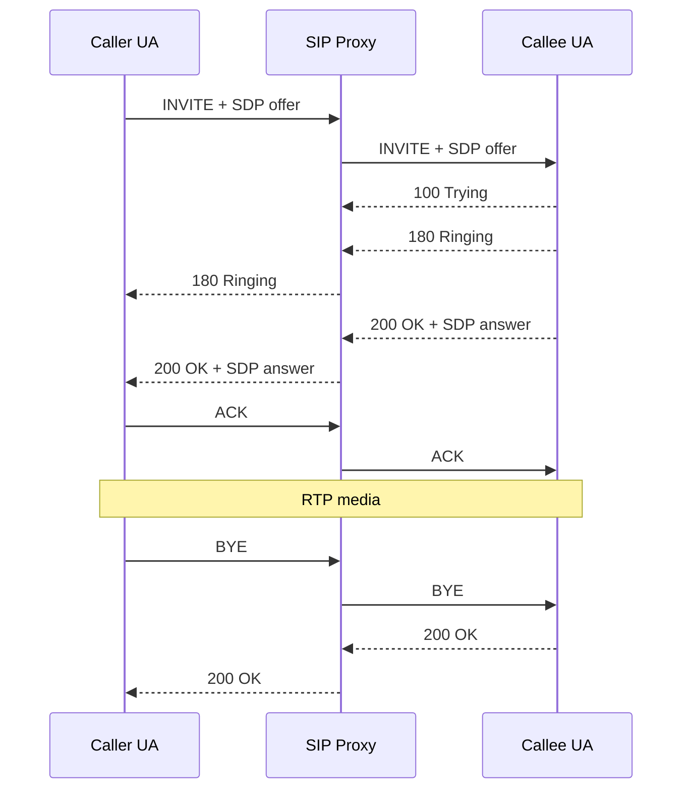

# Lab 01 — Baseline Successful SIP Call

## Objective

Before injecting failures, establish a known-good SIP and RTP call and learn to identify the normal signaling landmarks. Every later lab should be compared against this baseline.

## Logical topology



## What to capture

Record a controlled call from initial INVITE through BYE. Identify:

- Request-URI
- Call-ID
- From/To URIs and tags
- top Via and branch
- CSeq
- Contact
- Record-Route/Route if a stateful proxy remains in path
- SDP `c=` address
- SDP `m=audio` port
- negotiated codec/payload type
- RTP source and destination
- teardown initiator

## Questions

1. Which device creates the Call-ID?
2. Does the proxy change the Call-ID?
3. Which messages establish the dialog tags?
4. Does the proxy remain in the signaling path after answer? Why?
5. Is the proxy in the RTP path?
6. Which SDP values determine where each endpoint expects media?
7. Does actual RTP match the negotiated SDP?
8. Who sends the BYE?

## Expected healthy observations

- INVITE receives timely provisional/final responses.
- The 2xx final response is acknowledged.
- SDP offer and answer contain mutually supported media.
- RTP flows in both expected directions.
- BYE receives a final `200 OK`.
- No unexplained transaction retransmissions continue after successful responses.

## Evidence checklist

When this lab is executed, add sanitized artifacts under this directory:

```text
capture/
  baseline.pcapng
analysis/
  sip-ladder.md
  rtp-analysis.md
```

Do not publish captures containing real credentials, customer calls, production phone numbers, private infrastructure information, or recorded customer audio.

## Production lesson

A healthy reference call is one of the most useful troubleshooting artifacts. Without a baseline, engineers can spend time investigating protocol behavior that is normal for the specific platform.
